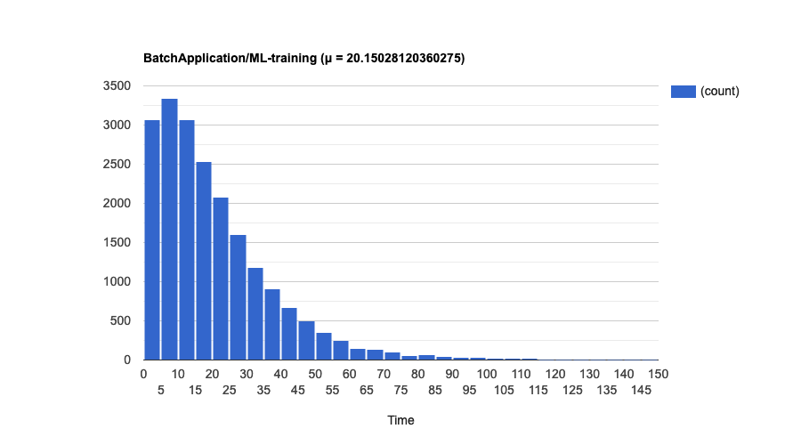
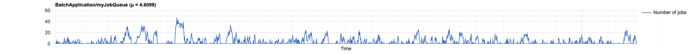

# CDK Batch Simulator

Suppose you need to run heavy batch workloads, such as training ML models,
running image processing algorithms on large files etc. Users of your system can
submit job requests at any time, and independently of each other. This makes it
impossible to know exactly when a job will arrive to be processed. You also
don't know exactly how long each job will take, as it depends on exactly what
kind of computation each one carries out. But historical data tells you, _on
average_, how many jobs arrive per hour and how long each job takes to run.

You are planning to implement this system on [AWS Batch], describing the
necessary infrastructure with the [CDK]. In order to serve your traffic
properly (based on your historical data), how many compute environments do you
need? What compute capacity should they have? Is it better to use Fargate, ECS
or EKS compute environments? If using EKS, which allocation strategy is better:
best fit or best fir progressive? What will happen if I need to add another job
queue?

This library can help you answer all these questions by simulating traffic to
your candidate infrastructure, before you deploy anything to AWS.

## Basic usage

Let's say you decide to start with the following set-up: a single job queue,
connected to a single Fargate compute environment, which can scale up to 60
vCPUs:

```ts
export class BatchApplicationStack extends cdk.Stack {
  constructor(scope: Construct, id: string, props?: cdk.StackProps) {
    super(scope, id, props);

    const vpc = new ec2.Vpc(this, 'myVpc');
    const environment = new batch.FargateComputeEnvironment(this, 'env', {
      vpc,
      maxvCpus: 60,
    });
    const queue: batch.JobQueue = new batch.JobQueue(this, 'myJobQueue');
    queue.addComputeEnvironment(environment, 1);
  }
}
```

Also, let's say that all jobs run in containers with 4 dedicated vCPUs:

```ts
const jobDefinition = new batch.EcsJobDefinition(stack, 'ML-training', {
  container: new batch.EcsFargateContainerDefinition(stack, 'containerDef', {
    image: ecs.ContainerImage.fromRegistry('some-docker-image'),
    memory: Size.mebibytes(1024),
    cpu: 4,
  }),
});
```

In your main CDK application entrypoint, you can simulate how this
infrastructure will handle traffic like this:

```ts
const app = new cdk.App();
const stack = new BatchApplicationStack(app, 'BatchApplication');

/* 
Assuming the behaviour of this system can be approximated by a Markov process:

- Jobs arrive at the queue independently of each other.
- The average rate (job arrivals per time period) is constant.
- The service times (how long job executions take) are exponentially distributed.
- Two events cannot occur at the same time.
*/
const simulator = BatchSimulator.markov(stack);

// const jobDefinition = ... (as defined above)

app.synth();

const report = simulator.simulate([{
  jobDefinition,
  meanServiceTime: 15, // minutes
  arrivalRate: 0.9, // jobs/min = 54 jobs/h
}]);
```

Notice that, in this example, we get a job almost every minute, but it takes 15
minutes for a job to execute (and thus leave the system). If we were to process
these jobs sequentially, the queue would grow indefinitely over time at this
rate. Fortunately, the compute environment has 15 times the capacity needed to
process such jobs (an [M/M/15][mmc] queue, in Kendall's notation). The
simulation report tells us exactly how the service times are distributed:



As we would expect, the shape of the graph resembles that of an exponential
distribution. The mean time in this particular simulation was about 17.88
minutes, somewhat above the average 15 minutes to run a job. The extra time was
spent by the jobs waiting in the queue.

The report also shows how congested the system was over time, reflected by the
number of jobs in the queue at each point in time:



## Fair-share scheduling

Now suppose that there are two departments in your company that can submit jobs
of this type to be processed: Research and Finance, with Finance accounting for
about 80% of the jobs submitted. You can model this scenario with weight factor
probabilities:

```ts
const report = simulator.simulate([{
  jobDefinition: jobDefinition,
  meanServiceTime: 15,
  arrivalRate: 0.9,
  weightFactorProbabilities: {
    Research: 0.2,
    Finance: 0.8,
  },
}]);
```

As the simulation report shows, both departments have to wait about the same
amount of time (about 19.7 min), on average, for their jobs to finish. This is
because the default scheduling policy for a job queue is first-in, first-out (
FIFO).


But let's say you have a service leval agreement with the Research department
that the mean execution time from their perspective (from submission to
completion) will be less than 17 min. One way to achieve this is by
deprioritizing the Finance jobs, using fair-share scheduling instead of FIFO. By
experimenting with different sets of values (and running a simulation for each
one), we conclude that we can achieve the desired result by giving the Research
jobs 8 times more weight than Finance jobs:

```ts
const queue: batch.JobQueue = new batch.JobQueue(this, 'myJobQueue', {
  schedulingPolicy: new batch.FairshareSchedulingPolicy(this, 'fairshare', {
    shares: [{
      shareIdentifier: 'Research',
      weightFactor: 1,
    }, {
      shareIdentifier: 'Finance',
      // weightFactor is inversely correlated with the number of vCPUs
      // allocated to a share identifier.
      weightFactor: 8,
    }],
  }),
});
```

The resulting distributions are about 22 minutes for Finance and 16.5 minutes
for Research:


Notice that this came at the cost of an increased time for Finance compared to
the FIFO policy.

[//]: # (TODO: compute reservation)

## Retry strategies

Let's go back to the basic example, and add a retry strategy, in which jobs that
fail with a non-zero exit code are retried up to 2 times:

```ts
const jobDefinition = new batch.EcsJobDefinition(stack, 'ML-training', {
  container: new batch.EcsFargateContainerDefinition(stack, 'containerDef', {
    image: ecs.ContainerImage.fromRegistry('some-docker-image'),
    memory: Size.mebibytes(1024),
    cpu: 4,
  }),
  retryAttempts: 2,
  retryStrategies: [{
    action: Action.RETRY,
    on: Reason.NON_ZERO_EXIT_CODE
  }],
});
```

What happens if jobs of this definition have a 95% probability of success? Let's
model this first:

```ts
const report = simulator.simulate([{
  jobDefinition: jobDefinition,
  meanServiceTime: 15,
  arrivalRate: 0.9,
  successProbability: 0.95,
}]);
```

And then run a simulation, which shows that the mean time jumps to about 28
minutes, in this case:


> **Note**
> The simulator doesn't take into account the error reasons. In the 
> simulation, generated jobs that are considered to fail will be "retried" 
> if their job definition has at least one retry strategy with action `RETRY`.

[//]: # (TODO: "Future work" section)

[AWS Batch]: https://aws.amazon.com/batch/

[CDK]: https://aws.amazon.com/cdk/

[mmc]: https://www.wikiwand.com/en/M/M/c_queue